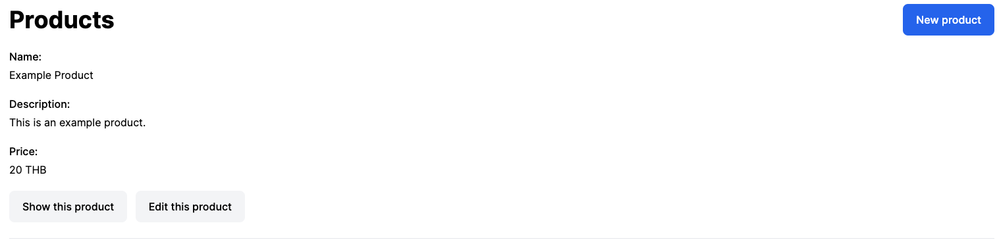

# Spellbook React Test

Hey 👋 Welcome to Spellbook's React Test - v1. The goal of this exercise is to determine your level of understanding of React at a basic to intermediate level. This test is intended for mid-level React developers.

## The App

The web application that you will need to build should take less than 2 hours to build without additional research and learning time.

You will be building the beginnings of an e-commerce web app. We have provided you with a fully functioning backend. The API is hosted at [Render](https://render.com) on a free plan and may be inactive. Wake it up by sending an initial HTTP request. After ~30 seconds, the service should become active and start to function normally.

## Objectives

1. Setup your own React project.

   1. You may use any tooling to get started, i.e. Next.js, Vite, Create-React-App, etc.
   2. Use Tailwind CSS for styling.

2. Create Admin interfaces for managing Products.

## What we're looking for

We want to see that you can create a clean and maintainable React codebase. As a Frontend Developer, we want to see how you manage the flow of data to and from a RESTful API. Attention to detail is something we value for our take-home tests. 😉

## Specs

Your app should route the following paths:

1. `/products`

   The user should see all Products here. They should be able to navigate to the `/products/:product_id` and `/products/:product_id/edit` pages from here.

2. `/products/new`

   The user should be able to create a new Product on this page.

3. `/products/:product_id`

   The user should be able to see the details of a Product on this page. The user should also be able to navigate to the `/products/:product_id/edit` page.

4. `/products/:product_id/edit`

   The user should be able to make changes to a Product's details on this page. They should also be able to delete the Product from this page.

## API Documentation

To complete this project, you will need to send and receive data from our API hosted at https://rails-interview.spellbook.tech.

For this exercise, you will be using the V1 Admin API.

<details>
  <summary>
    GET /api/v1/admin/products
  </summary>

<br />

Response

```json
[
  {
    "created_at": "2023-08-06T21:04:26.461Z",
    "description": "An Apple Macbook Pro.",
    "id": 8,
    "name": "Apple Macbook Pro",
    "price": {
      "currency": "THB",
      "subunit": 1000000
    },
    "updated_at": "2023-08-06T21:04:26.461Z"
  }
]
```

</details>

<details>
  <summary>
    POST /api/v1/admin/products
  </summary>

<br />

Parameters

```json
{
  "name": "Apple Macbook Pro",
  "description": "An Apple Macbook Pro.",
  "price_subunit": 1000000,
  "price_currency": "THB"
}
```

Response

```json
{
  "created_at": "2023-08-06T21:04:26.461Z",
  "description": "An Apple Macbook Pro.",
  "id": 8,
  "name": "Apple Macbook Pro",
  "price": {
    "currency": "THB",
    "subunit": 1000000
  },
  "updated_at": "2023-08-06T21:04:26.461Z"
}
```

</details>

<details>
  <summary>
    GET /api/v1/admin/products/:product_id
  </summary>

<br />

Response

```json
{
  "created_at": "2023-08-06T21:04:26.461Z",
  "description": "An Apple Macbook Pro.",
  "id": 8,
  "name": "Apple Macbook Pro",
  "price": {
    "currency": "THB",
    "subunit": 1000000
  },
  "updated_at": "2023-08-06T21:04:26.461Z"
}
```

</details>

<details>
  <summary>
    PATCH/PUT /api/v1/admin/products/:product_id
  </summary>

<br />

Parameters

```json
{
  "name": "Apple Macbook Pro?",
  "description": "An Apple Macbook Pro.",
  "price_subunit": 1000000,
  "price_currency": "THB"
}
```

Response

```json
{
  "created_at": "2023-08-06T21:04:26.461Z",
  "description": "An Apple Macbook Pro.",
  "id": 8,
  "name": "Apple Macbook Pro?",
  "price": {
    "currency": "THB",
    "subunit": 1000000
  },
  "updated_at": "2023-08-06T21:04:26.461Z"
}
```

</details>

<details>
  <summary>
    DELETE /api/v1/admin/products/:product_id
  </summary>

<br />

If successful, you will receive a 200 OK response with no body.

</details>

## Submission

Once you are complete with the tasks above, please push your code to your public GitHub profile and send us the link! We'll have a look and get back to you as soon as we can!
